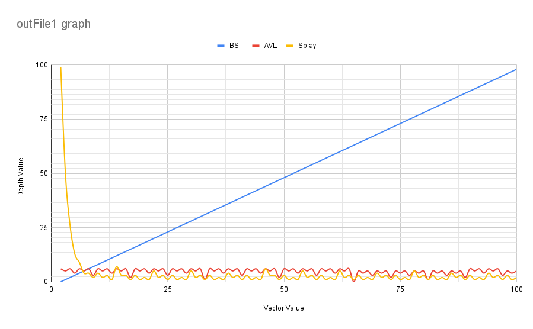

# CS 124 Project 3

### Report
# -------------

* You will have a different grader again, so make sure your report includes information about your dataset.
# I got the data from a site called DBKpop, a self-proclaimed "Kpop database". I made sure to run through some data points that I could effectivly verify to sample. I chose this data set because I like kpop and I thought that it could have some interesting data to look at considering we'll be using the same data for the rest of the projects. I also knew there would be plenty of data entries and available attributes to play around with. There are 7 variables: row (a unique integer indicating the row of data from source), romName (a string indicating the individual's "romanized" name, romanization in this context being the process of phonetically converting a Korean name into English letters; for foreign fans this might be more recognizable than the individual's 'kName'), kName (a string indicating the individual's name in Korean), yOB (an integer indicating the individual's birth year), primGroup (# I got the data from a site called DBKpop, a self-proclaimed "Kpop database". I made sure to run through some of the data points that I could effectivly verify to sample. I chose this data set because I like kpop and I thought that it could have some interesting data to look at considering we'll be using the same data for the rest of the projects. I also knew there would be plenty of data entries and available attributes to play around with. There are 7 variables: row (a unique integer indicating the row of data from source), romName (a string indicating the individual's "romanized" name, romanization in this context being the process of phonetically converting a Korean name into English letters; for foreign fans this might be more recognizable than the individual's 'kName'), kName (a string indicating the individual's name in Korean), yOB (an integer indicating the individual's birth year), primGroup (a string indicating the individual's primary group, as some individuals may be known to work/promote with multiple groups aside from their primary), country (a string indicating which country the individual is from), gender (a char indicating the individual's gender, 'F' representing 'female' and 'M' representing 'male').
# -------------

* How do the depths of the random-ordered integers compare to the depths of the ordered integers for each tree? Why?
# When the integers are sorted in order, the depths progress as you would expect for each tree, following the typical behavior expected for each method. Whereas when the integers were randomly sorted, these processes clearly shifted. In the ordered file, the BST's depth follows the value's pattern, increasing by 1 every step from 0-100 (because the right child will always be greater than the parent), but in the random file the BST is more evenly distributed, actually having 2 children to a parent and having to adjust with each addition, because unlike in the ordered file, the numbers weren't coming through in a way that made left-children impossible. In the AVL's ordered file you can see the child-^parent^-child/small-^medium^-large pattern from the beginning, but when looking at the random file we see the rotations needed to balance start immediately as more contrasting numbers are inserted. With the ordered splay we see larger depths of 99, 50, 26, and 13, which we don't see in the random file. This is because, like with the AVL, rotations are needed immediately as more extreme numbers impact the current splay, and since rebalancing is needed from the start we don't see the larger depths in the randomized file.
# -------------

* How do the depths of each custom-data-type tree compare to each other?
# The custom BSTs' depth progresses linearly, the custom AVLs' depth reflects the continuously re-distributing rotations, with the most common depth appearing to be 10. The custom splay trees' depth starts out at the max of my data set, decreasing down from there abruptly from 1657 to 829, 415, 207, 106, 53, 28, 14, to 10, before it settles into oscillating through the single-digits. From there is stays fairly consistent down there, reflecting the consistent rotations and re-distribution.  
# -------------

* Why do the depths of the second custom-data-type Splay Tree make sense?
# When I searched and recorded the depth in the second splay for each object 5 times, the first splay is the same one as seen in the first custom data file, but the second-fifth splay iterations are filled with zeros. This is because of how splay trees work, being that in the first splay iteration, it records as normal, but when an element is searched for in a splay tree, the tree reorganizes itself to move that element to be the root of the tree, putting it on depth/level 0. Therefore, when the first iteration searches it moved the element to the root, and when the other 4 iterations search the same element, they return as depth=0 because that element is currently the root from when it was searched in the first iteration. So, the first round progresses as normal, but any back-to-back repeats of the same search will return as depth=0.
# -------------

* Graph the Binary Search Tree, AVL Tree, and Splay Tree depths: 
# I showed this to Professor Cafiero & he said it was fine/made sense with the way I decided to put all three in one graph. 
# ------------- 

* Compare and contrast the graphs and explain the differences based on what you know about the structure and behavior of the trees. Justify the time complexity of searching the trees based on the results.
# I used one line graph to compare all 3 trees from the ordered file side-by-side. The BST tree looks as expected, its linear relationship on the graph demonstrating the one-sided pattern that the BST gained from the ordered sequence. The AVL tree oscillates up and down but stays horizontally contained the whole time, demonstrating how the tree re-balances itself throughout to maintain the '0-1 level difference max'. Meanwhile, the splay tree shows a dramatic depth drop from 99 to the single digits as the splay then starts to rotate and rebalance itself, leading to a more mild pattern with consistant, mild rotations. The splay tree would have the fastest time complexity, shown on the graph by how it keeps itself low to the x-axis and oscillates the least (after the initial decline), as well as by how it's organization expedites repeat searches.
# -------------